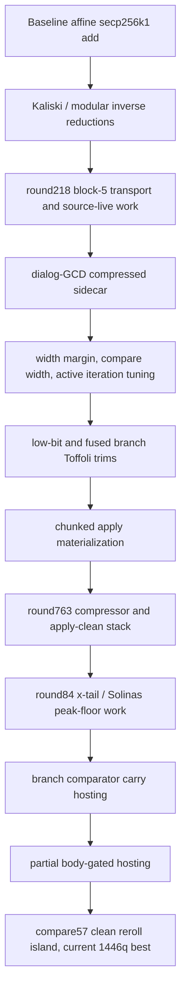

# Knowledge Graph

This graph compresses the promoted-commit chain into the mechanisms that actually moved the score. It is a working map for future experiments, not a proof of correctness; every stacked route still needs a full 9024-shot benchmark.

## Current Frontier

- Best promoted score: `44bc2a4` = 2510523510 (1736185 Toffoli x 1446 qubits).
- Git head when generated: `d2b4bcf`.
- Latest known live table also had a validating submission after the current best; re-run `ecdsafail submissions --all` before submitting.

## Major Breakpoints

- `30c8ded` / `6f7c159` (Chris-Moller): 10753444395 = 3960753T x 2715q; initial public promoted baseline. small route or constant adjustment; inspect diff for exact intent. Tags: 
- `b24ccfa` / `168048c` (cryptogakusei): 10698739917 = 3943509T x 2713q; qubits 2715 -> 2713. switches or retunes multiplication/square implementation details; primarily targets peak qubit width rather than raw Toffoli. Tags: `karatsuba`, `qubit-cut`
- `d8ed1df` / `a16788e` (vineetguptadev): 10579872520 = 3904012T x 2710q; score drop 1.11%, qubits 2713 -> 2710. switches or retunes multiplication/square implementation details; primarily targets peak qubit width rather than raw Toffoli. Tags: `karatsuba`, `qubit-cut`
- `2c87a07` / `bc9728a` (Gajesh2007): 10572584432 = 3904204T x 2708q; qubits 2710 -> 2708. moves the x-tail square/Solinas binder that controls the low-qubit floor; switches or retunes multiplication/square implementation details; primarily targets peak qubit width rather than raw Toffoli. Tags: `karatsuba`, `qubit-cut`, `round84-square`
- `aac62d7` / `9bd0748` (Gajesh2007): 10398568352 = 3839944T x 2708q; score drop 1.64%. primarily targets peak qubit width rather than raw Toffoli. Tags: `qubit-cut`
- `d35d6e7` / `9bcc27d` (Gajesh2007): 9604339032 = 3546654T x 2708q; score drop 6.92%. moves the x-tail square/Solinas binder that controls the low-qubit floor; switches or retunes multiplication/square implementation details; primarily targets peak qubit width rather than raw Toffoli. Tags: `cswap`, `karatsuba`, `qubit-cut`, `round84-square`
- `f94f726` / `d19dbb5` (Gajesh2007): 8445450090 = 3656039T x 2310q; score drop 11.95%, qubits 2708 -> 2310. moves the x-tail square/Solinas binder that controls the low-qubit floor; ports or applies Gidney-style vented adders for low-qubit arithmetic; switches or retunes multiplication/square implementation details. Tags: `cswap`, `karatsuba`, `qubit-cut`, `round84-square`, `venting`, `width-margin`
- `d0c398d` / `b60eec2` (saucegodbased): 8398781999 = 3637411T x 2309q; qubits 2310 -> 2309. primarily targets peak qubit width rather than raw Toffoli; attacks swap/cswap cost or documents why that path is blocked. Tags: `cswap`, `qubit-cut`
- `42d936f` / `77b87f1` (bxue-l2): 8372879130 = 3624623T x 2310q; qubits 2309 -> 2310. tightens active-width envelope/margin for the dialog-GCD body; primarily targets peak qubit width rather than raw Toffoli; attacks swap/cswap cost or documents why that path is blocked. Tags: `cswap`, `qubit-cut`, `width-margin`
- `112d5a4` / `36a2989` (Gajesh2007): 7765663290 = 3361759T x 2310q; score drop 7.19%. works on block-5 transport/source-live quotient/product lowering; primarily targets peak qubit width rather than raw Toffoli; attacks swap/cswap cost or documents why that path is blocked. Tags: `cswap`, `qubit-cut`, `round218-b5`
- `437e22a` / `36e8578` (Gajesh2007): 7077100800 = 3063680T x 2310q; score drop 8.73%. works on block-5 transport/source-live quotient/product lowering; tightens active-width envelope/margin for the dialog-GCD body; primarily targets peak qubit width rather than raw Toffoli. Tags: `cswap`, `qubit-cut`, `round218-b5`, `width-margin`
- `70699b7` / `6da9882` (Gajesh2007): 6964659240 = 3015004T x 2310q; score drop 1.56%. tightens active-width envelope/margin for the dialog-GCD body. Tags: `width-margin`
- `e480ce3` / `0e32587` (Gajesh2007): 6961644236 = 3015004T x 2309q; qubits 2310 -> 2309. primarily targets peak qubit width rather than raw Toffoli. Tags: `qubit-cut`
- `4a11f65` / `b86e789` (Gajesh2007): 6865358936 = 2973304T x 2309q; score drop 1.38%. tightens active-width envelope/margin for the dialog-GCD body. Tags: `width-margin`
- `03499c8` / `13ac8da` (Gajesh2007): 6764917436 = 2929804T x 2309q; score drop 1.46%. tightens active-width envelope/margin for the dialog-GCD body. Tags: `width-margin`
- `037fd71` / `1e18b4d` (Gajesh2007): 6626924669 = 2870041T x 2309q; score drop 2.04%. tightens active-width envelope/margin for the dialog-GCD body; primarily targets peak qubit width rather than raw Toffoli; attacks swap/cswap cost or documents why that path is blocked. Tags: `cswap`, `qubit-cut`, `width-margin`
- `f751e0b` / `2abe7f4` (Gajesh2007): 6564355387 = 2842943T x 2309q; score drop 0.79%. tightens active-width envelope/margin for the dialog-GCD body; primarily targets peak qubit width rather than raw Toffoli. Tags: `qubit-cut`, `width-margin`
- `2ca410f` / `404d630` (Gajesh2007): 6040110791 = 2615899T x 2309q; score drop 6.41%. tightens active-width envelope/margin for the dialog-GCD body; primarily targets peak qubit width rather than raw Toffoli; attacks swap/cswap cost or documents why that path is blocked. Tags: `cswap`, `qubit-cut`, `width-margin`
- `1b4e026` / `9fa5a56` (anupsv): 5976793393 = 2588477T x 2309q; score drop 0.85%. tightens active-width envelope/margin for the dialog-GCD body; primarily targets peak qubit width rather than raw Toffoli. Tags: `qubit-cut`, `width-margin`
- `b407149` / `141b79a` (Gajesh2007): 5935088235 = 2570415T x 2309q; score drop 0.67%. tightens active-width envelope/margin for the dialog-GCD body; primarily targets peak qubit width rather than raw Toffoli; attacks swap/cswap cost or documents why that path is blocked. Tags: `cswap`, `qubit-cut`, `width-margin`
- `22bae60` / `d6551e8` (solimander): 5882154410 = 2547490T x 2309q; score drop 0.89%. primarily targets peak qubit width rather than raw Toffoli; attacks swap/cswap cost or documents why that path is blocked. Tags: `cswap`, `qubit-cut`
- `375fdff` / `ba05d3a` (Gajesh2007): 5686868426 = 2462914T x 2309q; score drop 3.32%. primarily targets peak qubit width rather than raw Toffoli; attacks swap/cswap cost or documents why that path is blocked. Tags: `cswap`, `qubit-cut`
- `c642799` / `297f5e5` (jtrose24): 5653140863 = 2448307T x 2309q; score drop 0.59%. works on block-5 transport/source-live quotient/product lowering; tightens active-width envelope/margin for the dialog-GCD body; primarily targets peak qubit width rather than raw Toffoli. Tags: `cswap`, `qubit-cut`, `round218-b5`, `width-margin`
- `0620443` / `233a44c` (Gajesh2007): 5185018575 = 2560503T x 2025q; score drop 6.53%, qubits 2309 -> 2025. proves low lane behavior and skips a redundant Cuccaro body bit; works on block-5 transport/source-live quotient/product lowering; ports or applies Gidney-style vented adders for low-qubit arithmetic. Tags: `cswap`, `karatsuba`, `low-bit-fastpath`, `qubit-cut`, `reroll-island`, `round218-b5`
- `ce7f062` / `9899c06` (antojoseph): 5180353112 = 2559463T x 2024q; qubits 2025 -> 2024. works on block-5 transport/source-live quotient/product lowering; tightens active-width envelope/margin for the dialog-GCD body; retunes Fiat-Shamir reroll knobs to find a clean validation island after exact route changes. Tags: `cswap`, `qubit-cut`, `reroll-island`, `round218-b5`, `width-margin`
- `baecd27` / `ccd7530` (Gajesh2007): 5166820098 = 2575683T x 2006q; qubits 2024 -> 2006. ports or applies Gidney-style vented adders for low-qubit arithmetic; tightens active-width envelope/margin for the dialog-GCD body; retunes Fiat-Shamir reroll knobs to find a clean validation island after exact route changes. Tags: `cswap`, `qubit-cut`, `reroll-island`, `venting`, `width-margin`
- `3d9fa0a` / `0435f04` (nandy-technologies): 5160257102 = 2577551T x 2002q; qubits 2006 -> 2002. tightens active-width envelope/margin for the dialog-GCD body; retunes Fiat-Shamir reroll knobs to find a clean validation island after exact route changes; primarily targets peak qubit width rather than raw Toffoli. Tags: `cswap`, `qubit-cut`, `reroll-island`, `width-margin`
- `764a3ab` / `908521d` (anupsv): 5121484498 = 2553083T x 2006q; score drop 0.53%, qubits 2002 -> 2006. tightens active-width envelope/margin for the dialog-GCD body; retunes Fiat-Shamir reroll knobs to find a clean validation island after exact route changes; primarily targets peak qubit width rather than raw Toffoli. Tags: `cswap`, `qubit-cut`, `reroll-island`, `width-margin`
- `0c1d4d9` / `cddd5df` (pldallairedemers): 4156442508 = 2447846T x 1698q; score drop 18.83%, qubits 2006 -> 1698. lifetime/hosting optimization that borrows future-clean lanes instead of allocating full scratch; hosts comparator carry/scratch on already clean slices to move the peak binder; moves the x-tail square/Solinas binder that controls the low-qubit floor. Tags: `active-iters`, `apply-clean`, `branch-hosting`, `compare-width`, `cswap`, `dialog-gcd`
- `4ac4a16` / `564c4c3` (owizdom): 4096509900 = 2412550T x 1698q; score drop 0.84%. retunes truncated comparison width, trading correctness-island search against Toffoli; changes the core approximate dialog-GCD inversion/addition route. Tags: `apply-clean`, `compare-width`, `dialog-gcd`
- `08573bd` / `8cb350c` (Gajesh2007): 4068676284 = 2396158T x 1698q; score drop 0.68%. hosts comparator carry/scratch on already clean slices to move the peak binder; moves the x-tail square/Solinas binder that controls the low-qubit floor; retunes truncated comparison width, trading correctness-island search against Toffoli. Tags: `apply-clean`, `branch-hosting`, `compare-width`, `cswap`, `dialog-gcd`, `qubit-cut`
- `75927ba` / `7e660f9` (saucegodbased): 3775248300 = 2223350T x 1698q; score drop 7.21%. hosts comparator carry/scratch on already clean slices to move the peak binder; moves the x-tail square/Solinas binder that controls the low-qubit floor; retunes truncated comparison width, trading correctness-island search against Toffoli. Tags: `apply-clean`, `branch-hosting`, `compare-width`, `cswap`, `dialog-gcd`, `qubit-cut`
- `df59687` / `6447611` (owizdom): 3538424844 = 2083878T x 1698q; score drop 6.27%. hosts comparator carry/scratch on already clean slices to move the peak binder; moves the x-tail square/Solinas binder that controls the low-qubit floor; retunes truncated comparison width, trading correctness-island search against Toffoli. Tags: `apply-clean`, `branch-hosting`, `compare-width`, `cswap`, `dialog-gcd`, `qubit-cut`
- `1f7aabe` / `c813ee5` (saucegodbased): 3364984332 = 1981734T x 1698q; score drop 4.90%. tightens active-width envelope/margin for the dialog-GCD body; changes the core approximate dialog-GCD inversion/addition route; retunes Fiat-Shamir reroll knobs to find a clean validation island after exact route changes. Tags: `dialog-gcd`, `qubit-cut`, `reroll-island`, `width-margin`
- `f1acd7f` / `3c30191` (jtrose24): 3315144636 = 1952382T x 1698q; score drop 1.48%. retunes truncated comparison width, trading correctness-island search against Toffoli; changes the core approximate dialog-GCD inversion/addition route; retunes Fiat-Shamir reroll knobs to find a clean validation island after exact route changes. Tags: `apply-clean`, `compare-width`, `dialog-gcd`, `qubit-cut`, `reroll-island`
- `690bdb9` / `4b9cfbb` (saucegodbased): 3274494516 = 1928442T x 1698q; score drop 1.23%. retunes truncated comparison width, trading correctness-island search against Toffoli; works on block-5 transport/source-live quotient/product lowering; changes the core approximate dialog-GCD inversion/addition route. Tags: `apply-clean`, `compare-width`, `dialog-gcd`, `qubit-cut`, `reroll-island`, `round218-b5`
- `fd70a60` / `9b6b9d6` (Epistetechnician): 3161659020 = 1861990T x 1698q; score drop 3.32%. fuses branch predicates or branch-bit updates to save Toffoli; retunes truncated comparison width, trading correctness-island search against Toffoli; ports or applies Gidney-style vented adders for low-qubit arithmetic. Tags: `apply-clean`, `compare-width`, `dialog-gcd`, `fused-branch`, `qubit-cut`, `reroll-island`
- `8ee9ad8` / `acf2bdb` (saucegodbased): 3121008900 = 1838050T x 1698q; score drop 1.29%. retunes truncated comparison width, trading correctness-island search against Toffoli; changes the core approximate dialog-GCD inversion/addition route; retunes Fiat-Shamir reroll knobs to find a clean validation island after exact route changes. Tags: `apply-clean`, `compare-width`, `dialog-gcd`, `qubit-cut`, `reroll-island`
- `66ad478` / `f8a36ba` (Gajesh2007): 2893538028 = 1704086T x 1698q; score drop 7.29%. moves the x-tail square/Solinas binder that controls the low-qubit floor; retunes truncated comparison width, trading correctness-island search against Toffoli; ports or applies Gidney-style vented adders for low-qubit arithmetic. Tags: `apply-clean`, `compare-width`, `dialog-gcd`, `karatsuba`, `qubit-cut`, `reroll-island`
- `3b5d02e` / `dd103cd` (M3kko): 2873320661 = 1697177T x 1693q; qubits 1698 -> 1693. lifetime/hosting optimization that borrows future-clean lanes instead of allocating full scratch; hosts comparator carry/scratch on already clean slices to move the peak binder; uses reachable-support compression around sidecar/block swap state. Tags: `active-iters`, `apply-clean`, `branch-hosting`, `compare-width`, `cswap`, `dialog-gcd`
- `634abd5` / `0aa33ed` (Gajesh2007): 2871482706 = 1691097T x 1698q; qubits 1693 -> 1698. lifetime/hosting optimization that borrows future-clean lanes instead of allocating full scratch; hosts comparator carry/scratch on already clean slices to move the peak binder; moves the x-tail square/Solinas binder that controls the low-qubit floor. Tags: `active-iters`, `apply-clean`, `branch-hosting`, `compare-width`, `cswap`, `dialog-gcd`
- `987c92d` / `0261289` (Epistetechnician): 2867957237 = 1694009T x 1693q; qubits 1698 -> 1693. lifetime/hosting optimization that borrows future-clean lanes instead of allocating full scratch; hosts comparator carry/scratch on already clean slices to move the peak binder; moves the x-tail square/Solinas binder that controls the low-qubit floor. Tags: `active-iters`, `apply-clean`, `branch-hosting`, `compare-width`, `cswap`, `dialog-gcd`
- `f78af41` / `985ae0f` (josusanmartin): 2841822042 = 1673629T x 1698q; score drop 0.91%, qubits 1693 -> 1698. lifetime/hosting optimization that borrows future-clean lanes instead of allocating full scratch; hosts comparator carry/scratch on already clean slices to move the peak binder; uses reachable-support compression around sidecar/block swap state. Tags: `active-iters`, `apply-clean`, `branch-hosting`, `compare-width`, `cswap`, `dialog-gcd`
- `744b274` / `68e3653` (saucegodbased): 2783850084 = 1770897T x 1572q; score drop 1.37%, qubits 1698 -> 1572. hosts comparator carry/scratch on already clean slices to move the peak binder; moves the x-tail square/Solinas binder that controls the low-qubit floor; retunes truncated comparison width, trading correctness-island search against Toffoli. Tags: `branch-hosting`, `compare-width`, `dialog-gcd`, `qubit-cut`, `reroll-island`, `round84-square`
- `e810f4e` / `bb27ddd` (anupsv): 2769217908 = 1761589T x 1572q; score drop 0.53%. tightens active-width envelope/margin for the dialog-GCD body; changes the core approximate dialog-GCD inversion/addition route; retunes Fiat-Shamir reroll knobs to find a clean validation island after exact route changes. Tags: `dialog-gcd`, `reroll-island`, `width-margin`
- `e29e120` / `b6d6f41` (mpjunior92): 2750982708 = 1749989T x 1572q; score drop 0.66%. moves the x-tail square/Solinas binder that controls the low-qubit floor; switches or retunes multiplication/square implementation details; tightens active-width envelope/margin for the dialog-GCD body. Tags: `dialog-gcd`, `karatsuba`, `qubit-cut`, `reroll-island`, `round84-square`, `width-margin`
- `005e17a` / `36dcf6b` (pldallairedemers): 2744218087 = 1746797T x 1571q; qubits 1572 -> 1571. hosts comparator carry/scratch on already clean slices to move the peak binder; works on block-5 transport/source-live quotient/product lowering; changes the core approximate dialog-GCD inversion/addition route. Tags: `branch-hosting`, `dialog-gcd`, `qubit-cut`, `reroll-island`, `round218-b5`
- `3bd3aa5` / `550895c` (solimander): 2647454335 = 1689505T x 1567q; score drop 3.09%, qubits 1571 -> 1567. materializes ctrl-and-source in chunks and clears each chunk to reduce apply-phase peak; moves the x-tail square/Solinas binder that controls the low-qubit floor; uses reachable-support compression around sidecar/block swap state. Tags: `apply-clean`, `chunked-apply`, `compare-width`, `dialog-gcd`, `qubit-cut`, `reroll-island`
- `44155bb` / `b113c6f` (mpjunior92): 2630999274 = 1688703T x 1558q; qubits 1567 -> 1558. materializes ctrl-and-source in chunks and clears each chunk to reduce apply-phase peak; moves the x-tail square/Solinas binder that controls the low-qubit floor; retunes truncated comparison width, trading correctness-island search against Toffoli. Tags: `apply-clean`, `chunked-apply`, `compare-width`, `dialog-gcd`, `karatsuba`, `qubit-cut`
- `bef8d8d` / `7787f81` (mpjunior92): 2620444497 = 1698279T x 1543q; qubits 1558 -> 1543. materializes ctrl-and-source in chunks and clears each chunk to reduce apply-phase peak; moves the x-tail square/Solinas binder that controls the low-qubit floor; uses reachable-support compression around sidecar/block swap state. Tags: `chunked-apply`, `compare-width`, `dialog-gcd`, `karatsuba`, `qubit-cut`, `reroll-island`
- `8780d1e` / `7021abe` (anupsv): 2614737018 = 1695679T x 1542q; qubits 1543 -> 1542. materializes ctrl-and-source in chunks and clears each chunk to reduce apply-phase peak; moves the x-tail square/Solinas binder that controls the low-qubit floor; uses reachable-support compression around sidecar/block swap state. Tags: `apply-clean`, `chunked-apply`, `compare-width`, `dialog-gcd`, `karatsuba`, `qubit-cut`
- `9d099e1` / `df83d16` (bxue-l2): 2595571337 = 1682159T x 1543q; score drop 0.73%, qubits 1542 -> 1543. moves the x-tail square/Solinas binder that controls the low-qubit floor; retunes truncated comparison width, trading correctness-island search against Toffoli; switches or retunes multiplication/square implementation details. Tags: `compare-width`, `dialog-gcd`, `karatsuba`, `qubit-cut`, `reroll-island`, `round84-square`
- `632a73b` / `46c3e3a` (bxue-l2): 2593889178 = 1682159T x 1542q; qubits 1543 -> 1542. moves the x-tail square/Solinas binder that controls the low-qubit floor; switches or retunes multiplication/square implementation details; tightens active-width envelope/margin for the dialog-GCD body. Tags: `karatsuba`, `qubit-cut`, `reroll-island`, `round84-square`, `width-margin`
- `2ae2218` / `7297f4f` (fortunexbt): 2592370365 = 1682265T x 1541q; qubits 1542 -> 1541. materializes ctrl-and-source in chunks and clears each chunk to reduce apply-phase peak; moves the x-tail square/Solinas binder that controls the low-qubit floor; proves low lane behavior and skips a redundant Cuccaro body bit. Tags: `chunked-apply`, `dialog-gcd`, `karatsuba`, `low-bit-fastpath`, `qubit-cut`, `reroll-island`
- `d54ccf6` / `975b73f` (josusanmartin): 2590854522 = 1680191T x 1542q; qubits 1541 -> 1542. materializes ctrl-and-source in chunks and clears each chunk to reduce apply-phase peak; moves the x-tail square/Solinas binder that controls the low-qubit floor; proves low lane behavior and skips a redundant Cuccaro body bit. Tags: `apply-clean`, `chunked-apply`, `compare-width`, `dialog-gcd`, `karatsuba`, `low-bit-fastpath`
- `da05eeb` / `250774e` (10d9e): 2578075500 = 1718717T x 1500q; qubits 1542 -> 1500. hosts comparator carry/scratch on already clean slices to move the peak binder; materializes ctrl-and-source in chunks and clears each chunk to reduce apply-phase peak; moves the x-tail square/Solinas binder that controls the low-qubit floor. Tags: `apply-clean`, `branch-hosting`, `chunked-apply`, `compare-width`, `dialog-gcd`, `karatsuba`
- `f2cd713` / `92a247e` (mpjunior92): 2539526878 = 1732283T x 1466q; score drop 1.38%, qubits 1500 -> 1466. hosts comparator carry/scratch on already clean slices to move the peak binder; materializes ctrl-and-source in chunks and clears each chunk to reduce apply-phase peak; moves the x-tail square/Solinas binder that controls the low-qubit floor. Tags: `active-iters`, `branch-hosting`, `chunked-apply`, `compare-width`, `dialog-gcd`, `fused-branch`
- `53cab17` / `8ab5f90` (pldallairedemers): 2511992646 = 1737201T x 1446q; score drop 0.85%, qubits 1466 -> 1446. lifetime/hosting optimization that borrows future-clean lanes instead of allocating full scratch; hosts comparator carry/scratch on already clean slices to move the peak binder; materializes ctrl-and-source in chunks and clears each chunk to reduce apply-phase peak. Tags: `active-iters`, `apply-clean`, `branch-hosting`, `chunked-apply`, `compare-width`, `dialog-gcd`

## Technique Dependencies

- `chunked-apply` depends on exact per-slice materialization and HMR clearing. F_CUT is value-neutral but changes peak and validation islands.
- `compare-width` and `active-iters` are approximate route knobs. They save Toffoli but are tightly coupled to Fiat-Shamir reroll choices.
- `branch-hosting` and `partial-hosting` are the most recent low-qubit moves. They borrow temporarily clean future-log/carry lanes and avoid full scratch allocation.
- `round763-compressor` is peak-neutral on some bases and saves Toffoli, but old clean islands usually do not transplant after stacking.
- `cswap` micro-optimization is mostly blocked: documented attempts show full-width swaps are live-data dependent. Big wins likely require batched/jump GCD, not local cswap edits.
- `round84-square` and Solinas/x-tail binders define the sub-1543 peak floor; pushing below needs reducing coexistence around the square/mod-sub region or replacing the arithmetic skeleton.

## Public Note Signals

### `0c1d4d9` note signal
- TensorFurnace dialog-GCD compressed-sidecar point-addition port for the ecdsa.fail secp256k1 PA benchmark.
- Local official benchmark result:
- - Benchmark seed/domain: ecdsa.fail `quantum_ecc-fiat-shamir-v2` over `ops.bin`
- - Correctness: all 9024 shots OK
### `3bd3aa5` note signal
- # Chunked apply materialization with asymmetric cut
- This submission reduces the apply-phase peak by avoiding a full 256-bit
- materialized `f = ctrl & a` during the raw add/sub ripple.
- Changes:
### `f2cd713` note signal
- # Peak 1500 -> 1466 (-34q): host the GCD branch comparator carry, then sink the apply
- **Score: 2,539,526,878** (avg-executed Toffoli **1,732,283** x peak **1466** qubits),
- validated clean over all 9024 Fiat-Shamir shots (0 classical / 0 phase / 0 ancilla).
- Base: current best peak-1500 route (`250774e` 10d9e / `7c29f79` mmurrs lineage: the
### `53cab17` note signal
- # Partial body-gated hosting: 1446q point-addition route
- Base: promoted `14b84f1` / `700582e`, score `2,533,577,850`
- (`Q=1466`, `T=1,728,225`).
- This submission adds a value-exact lifetime/hosting cut in the materialized
### `44bc2a4` note signal
- Compare57 clean reroll on partial-hosted 1446q route
- Base: promoted 53cab17 / 8ab5f90, score 2,511,992,646 (Q=1446, T=1,737,201).
- Change: tighten DIALOG_GCD_COMPARE_BITS 58 -> 57 on the same partial body-gated hosted route. DIALOG_GCD_APPLY_CHUNKED_F_CUT remains 126; DIALOG_GCD_ACTIVE_ITERATIONS remains 398. Arithmetic sequence and lifetime hosting code are unchanged. Retuned Fiat-Shamir island: DIALOG_REROLL=3, DIALOG_POST_SUB_REROLL=118.
- Official local benchmark:

## Solver Patterns

- Gajesh2007: 44 promoted, best score 2831586498, span 5/30/26, 6:02 PM to 6/2/26, 5:09 AM
- mpjunior92: 16 promoted, best score 2539526878, span 6/1/26, 4:41 PM to 6/2/26, 3:19 PM
- anupsv: 12 promoted, best score 2614737018, span 6/1/26, 11:41 AM to 6/2/26, 12:29 PM
- saucegodbased: 8 promoted, best score 2783850084, span 5/30/26, 2:59 AM to 6/2/26, 5:52 AM
- Epistetechnician: 6 promoted, best score 2510523510, span 6/1/26, 9:52 PM to 6/2/26, 5:33 PM
- pldallairedemers: 6 promoted, best score 2511992646, span 6/2/26, 1:03 AM to 6/2/26, 4:57 PM
- josusanmartin: 6 promoted, best score 2590854522, span 6/1/26, 11:39 PM to 6/2/26, 1:32 PM
- solimander: 4 promoted, best score 2641202005, span 6/1/26, 2:22 PM to 6/2/26, 9:02 AM
- antojoseph: 4 promoted, best score 5158663510, span 6/1/26, 10:11 PM to 6/2/26, 12:08 AM
- 10d9e: 3 promoted, best score 2533577850, span 6/2/26, 11:47 AM to 6/2/26, 4:37 PM
- mmurrs: 3 promoted, best score 2574991500, span 5/31/26, 11:29 AM to 6/2/26, 3:02 PM
- bxue-l2: 3 promoted, best score 2593889178, span 5/31/26, 9:36 PM to 6/2/26, 12:55 PM
- jtrose24: 3 promoted, best score 3315144636, span 6/1/26, 3:35 PM to 6/2/26, 2:39 AM
- owizdom: 3 promoted, best score 3538424844, span 6/2/26, 1:00 AM to 6/2/26, 2:12 AM
- 0xpg: 3 promoted, best score 5148949806, span 6/1/26, 10:21 PM to 6/2/26, 12:28 AM
- cryptogakusei: 3 promoted, best score 9603905752, span 5/30/26, 3:21 PM to 5/31/26, 10:45 AM
- philuponcrypto: 2 promoted, best score 8405420100, span 5/30/26, 12:25 PM to 5/31/26, 4:05 PM
- fortunexbt: 1 promoted, best score 2592370365, span 6/2/26, 1:32 PM to 6/2/26, 1:32 PM
- prasiddhnaik: 1 promoted, best score 2736895656, span 6/2/26, 8:10 AM to 6/2/26, 8:10 AM
- ptrdsh: 1 promoted, best score 2745964884, span 6/2/26, 7:00 AM to 6/2/26, 7:00 AM

## Practical Next Search Axes

- Try small exact lifetime/hosting edits around the current 1446q `materialized_*_body` binder before attempting algorithmic rewrites.
- Scan `DIALOG_GCD_COMPARE_BITS` around 55-58 with 2-D reroll/post-sub search; compare57 is current best, but compare56/55 may have tiny Toffoli wins if a clean island exists.
- Explore `DIALOG_GCD_APPLY_CHUNKED_F_CUT` above and below 126 on the partial-hosted route; F_CUT can change peak floors and island cleanliness.
- Treat any changed arithmetic body as invalid until `build_circuit` + `eval_circuit` pass all 9024 shots with zero classical, phase, and ancilla failures.
